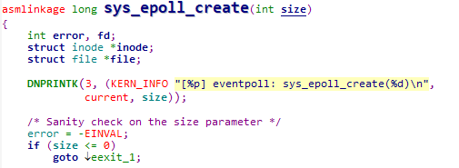
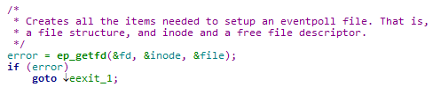
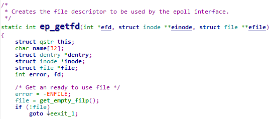
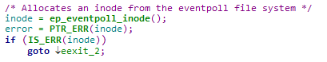
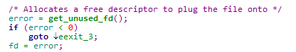
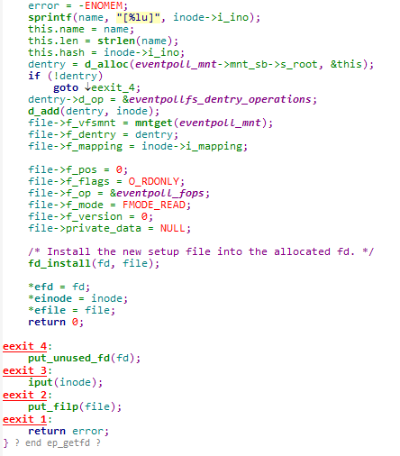
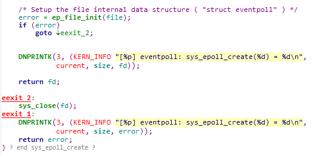
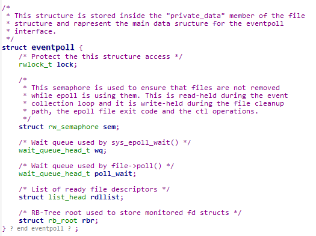
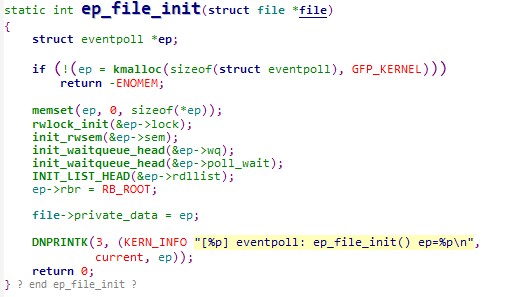

# sys_epoll_create

首先参数size，其实后边并没有实际使用，所以，用户设置的size并不会影响实际存储的fd数量。

接下来进入ep_getfd函数。

首先，获取一个struct file，底层通过slab分配。

从eventpoll文件系统分配一个inode结点。

分配一个空闲的文件描述符，留着后边将之前的struct file绑定。

分配dentry，配置struct file，将fd和file绑定。

回到sys_epoll_create

接下来进入ep_file_init

进入函数前先了解一下struct eventpoll

sem  读写信号量
wq sys_epoll_wait的等待队列
poll_wait  poll方法的等待队列  
rdllist 就绪文件描述符链  
rbr 红黑树根节点  

通过kmalloc分配struct eventpoll的内存空间，然后memset置零。  
初始化ep各个成员，将其赋给file的private_data  

最后sys_epoll_create返回其文件描述符。