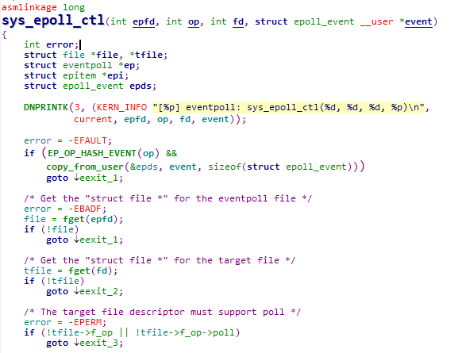
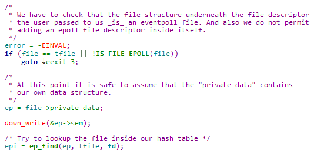
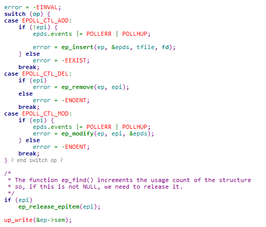
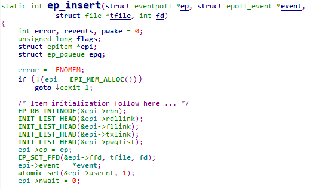

# sys_epoll_ctl

从用户空间拷贝struct epoll_event  
获取epfd对应的file指针  
获取目标文件描述符对应的file指针  
目标文件描述符必须有对应的poll方法  

  
首先进行检查操作，确保是epoll的file而且不能添加自己。  
从file的private_data取出struct eventpoll指针。  
加写信号量。  
在红黑树中，寻找目标fd对应的位置，如果不存在就返回NULL。  

根据op进入对应的操作，添加、删除或者修改。  

- 添加

从slab分配epitem

- 删除

- 修改

最后，sys_epoll_ctl