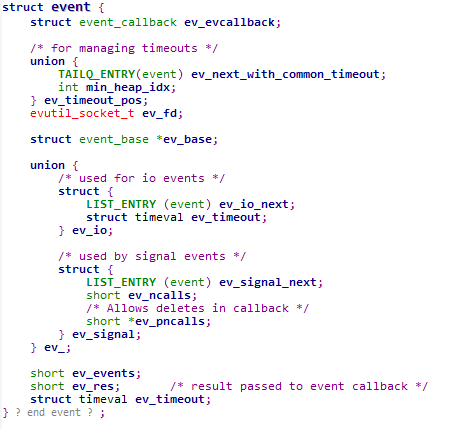
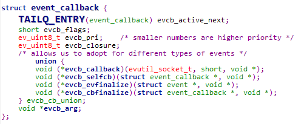
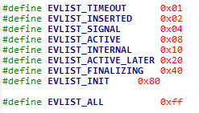
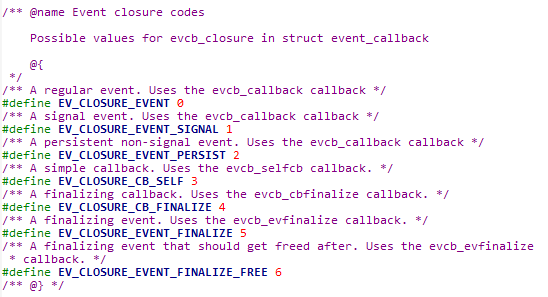

# 1.struct event

先来见识一下结构体的内容  
  

首先看到的就是ev_evcallback,对应的struct event_callback稍后介绍。  
ev_timeout_pos联合体  
ev_next_with_common_timeout ，通用定时器。 
min_heap_idx，在event中小根堆的索引。  

ev_base，由event_init函数返回，表示一个reactor实例，对应的struct event_base比较复杂，后期会讲。  
联合体中分为了I/O事件和signal事件，互斥的I/O事件和signal事件不能同时设置。  
ev_io_next I/O事件链   
ev_timeout 超时值   

ev_signal_next 信号事件链  
ev_ncalls 执行回调函数的次数  
ev_pncalls 指向ev_ncalls

ev_events 事件类型  
ev_res 当前激活事件的类型  
ev_timeout,和上边的min_heap_idx分别为timeout事件的超时值和索引  

接下来是event_callback  
  
evcb_active_next 活动事件队列  
evcb_flags 事件标志，判断事件处理器从属于通用定时器队列或时间堆、注册事件队列、没有使用、活动事件队列  
  
evcb_pri 指定事件处理器优先级，值越小则优先级越高  
evcb_closure 执行回调函数时的行为，默认行为、调用ev_ncalls次回调函数、执行完回调函数，再次将事件处理器加入注册事件队列中    
  
evcb_callback 回调函数  
evcb_arg 回调函数的参数  
//