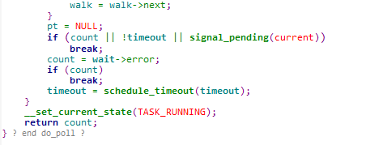

# poll源码剖析

阅读本文前，推荐先看select源码剖析。

首先来了解sys_poll参数里的一个结构体struct pollfd  
fd 文件描述符  
events 关心的事件  
revents 发生的事件  

先看参数  
ufds 用户空间的一个数组，相当于关心事件的事件集  
nfds 个数
timeout  超时值  
首先套路和select一样，先检查参数并初始化回调函数__pollwait。

将i置为nfds，开始while循环。  
每次循环，用kmalloc申请struct poll_list加上i个struct pollfd的空间，i不超过POLLFD_PER_PAGE，这个宏的定义是  
((PAGE_SIZE-sizeof(struct poll_list)) / sizeof(struct pollfd))  
简单看一下struct poll_list  

每次循环，或者说每个poll_list，最多占用一个页面来存储，用poll_list里的next来将这些链串接起来，len来表示个数，接着，从用户空间拷贝pollfd数据。

接下来执行do_poll函数。

在do_poll函数中，首先是第一层的for循环，设置可中断状态，walk指向poll_list链的头结点。  
进入第二层的while循环，只要walk没有走到尽头，就执行do_pollfd函数。

接下来进入do_pollfd函数。

在do_pollfd函数中，又是一个for循环，循环次数为此poll_list结点中的pollfd个数，也就是传的参数len。  
首先将mask置为0，之后将存入结果。对于每一个pollfd，获取其fd，然后通过fget函数，获得对应的file指针，以及file对应的f_op指针，来操作文件，通过f_op可以获得对应的poll函数。  
将mask置为默认值，其宏为  
DEFAULT_POLLMASK (POLLIN | POLLOUT | POLLRDNORM | POLLWRNORM)  
将关心的事件与poll方法结果的mask进行&运算，如果有事件发生，计数加1，然后将mask拷贝给存放返回事件的revents。  

然后回到do_poll的后半部分。

在while循环中，walk每次向后走，遍历所有的结点，来统计事件结果和发生事件的文件描述符总数。  
如果有事件发生或者超时或者被挂起，就break跳出最外层的for循环，否则就重新计算超时时间，重新循环。  
最后，置为运行状态，并返回发生事件的文件描述符个数。

接下来就回到sys_poll的后半部分。

首先遇到一个while循环，和之前遇到的那个循环一样，处理poll_list链的每一个结点，里面还有一个for循环，处理poll_list上每一个pollfd，每次循环就是将对应位置的事件结果revents拷贝到用户空间。  
最后循环来释放之前申请的poll_list+pollfd空间，然后返回发生事件的文件描述符的个数。
