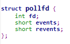
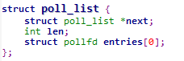

# poll源码剖析

首先看pollfd  
  
可以看到，pollfd保存文件描述符和对应的事件以及返回的事件。

然后看poll_list  
  
包含下一个节点的指针，长度以及后续存放pollfd的数组，数组长度根据kmalloc申请长度为准。

首先看sys_poll  

	asmlinkage long sys_poll(struct pollfd __user * ufds, unsigned int nfds, long timeout)
	{
		struct poll_wqueues table;
	 	int fdcount, err;
	 	unsigned int i;
		struct poll_list *head;
	 	struct poll_list *walk;
	
		/* Do a sanity check on nfds ... */
		if (nfds > current->files->max_fdset && nfds > OPEN_MAX)
			return -EINVAL;
	
		if (timeout) {
			/* Careful about overflow in the intermediate values */
			if ((unsigned long) timeout < MAX_SCHEDULE_TIMEOUT / HZ)
				timeout = (unsigned long)(timeout*HZ+999)/1000+1;
			else /* Negative or overflow */
				timeout = MAX_SCHEDULE_TIMEOUT;
		}
		/* 和select一样，注册回调函数 */
		poll_initwait(&table);
	
		head = NULL;
		walk = NULL;
		i = nfds;
		err = -ENOMEM;
		while(i!=0) {
			struct poll_list *pp;
			pp = kmalloc(sizeof(struct poll_list)+
					sizeof(struct pollfd)*
					(i>POLLFD_PER_PAGE?POLLFD_PER_PAGE:i),
						GFP_KERNEL);
			if(pp==NULL)
				goto out_fds;
			pp->next=NULL;
			pp->len = (i>POLLFD_PER_PAGE?POLLFD_PER_PAGE:i);
			/* 将pp入链 */
			if (head == NULL)
				head = pp;
			else
				walk->next = pp;
	
			walk = pp;
			/* 从用户空间拷贝数据,len数量的pollfd */
			if (copy_from_user(pp->entries, ufds + nfds-i, 
					sizeof(struct pollfd)*pp->len)) {
				err = -EFAULT;
				goto out_fds;
			}
			i -= pp->len;
		}
		/* do_poll来进行关键操作 */
		fdcount = do_poll(nfds, head, &table, timeout);
	
		/* OK, now copy the revents fields back to user space. */
		walk = head;
		err = -EFAULT;
		while(walk != NULL) {
			struct pollfd *fds = walk->entries;
			int j;
			/* 将所有关注的文件描述符产生的事件返回给用户空间 */
			for (j=0; j < walk->len; j++, ufds++) {
				if(__put_user(fds[j].revents, &ufds->revents))
					goto out_fds;
			}
			walk = walk->next;
	  	}
		err = fdcount;
		if (!fdcount && signal_pending(current))
			err = -EINTR;
	out_fds:
		walk = head;
		/* 释放之前申请的空间 */
		while(walk!=NULL) {
			struct poll_list *pp = walk->next;
			kfree(walk);
			walk = pp;
		}
		poll_freewait(&table);
		/* 返回产生事件的文件描述符的数量 */
		return err;
	}

接下来是do_poll

	static int do_poll(unsigned int nfds,  struct poll_list *list,
				struct poll_wqueues *wait, long timeout)
	{
		int count = 0;
		poll_table* pt = &wait->pt;
	
		if (!timeout)
			pt = NULL;
	 
		for (;;) {
			struct poll_list *walk;
			set_current_state(TASK_INTERRUPTIBLE);
			walk = list;
			/* 循环遍历链表每一个节点 */
			while(walk != NULL) {
				/* 调用do_pollfd来判断事件 */
				do_pollfd( walk->len, walk->entries, &pt, &count);
				walk = walk->next;
			}
			pt = NULL;
			/* 有事件产生就退出循环 */
			if (count || !timeout || signal_pending(current))
				break;
			count = wait->error;
			if (count)
				break;
			timeout = schedule_timeout(timeout);
		}
		__set_current_state(TASK_RUNNING);
		/* 返回产生事件的文件描述符计数 */
		return count;
	}

最后是do_pollfd  

	static void do_pollfd(unsigned int num, struct pollfd * fdpage,
		poll_table ** pwait, int *count)
	{
		int i;
		/* 循环遍历每个文件描述符 */
		for (i = 0; i < num; i++) {
			int fd;
			unsigned int mask;
			struct pollfd *fdp;
	
			mask = 0;
			fdp = fdpage+i;
			fd = fdp->fd;
			if (fd >= 0) {
				struct file * file = fget(fd);
				mask = POLLNVAL;
				if (file != NULL) {
					/* 设置poll的默认掩码 */
					mask = DEFAULT_POLLMASK;
					if (file->f_op && file->f_op->poll)
						/* 调用poll方法获得事件掩码 */
						mask = file->f_op->poll(file, *pwait);
					/* 产生的事件与关心的事件做与运算，找到共同的事件 */
					mask &= fdp->events | POLLERR | POLLHUP;
					fput(file);
				}
				/* 产生事件，增加计数 */
				if (mask) {
					*pwait = NULL;
					(*count)++;
				}
			}
			/* 记录事件结果 */
			fdp->revents = mask;
		}
	}