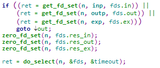
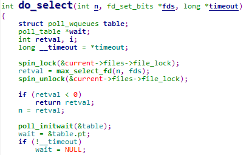

# select源码剖析

首先，我们先看sys_select的参数
  
n 文件描述符数量  
inp 读事件集合的用户空间指针  
outp 写事件集合的用户空间指针  
exp  异常事件集合的用户空间指针  
tvp 超时值指针 

来看一下fd_set这个结构  
  
那么就去看__kernel_fd_set    
  
归根到底是一个名为fds_bits的unsigned long类型数组，这个数组的长度为:

__FDSET_LONGS
宏中定义个数为1024个，然后一个unsigned long存的位数是 8*sizeof(unsigned long)  
所以，每一个位在数组的下标来代表一个描述符，这一个数组有1024个位，可以记录1024个文件描述符。  

然后我们开始分析函数的关键步骤

首先检查超时值，然后获取当前进程打开的文件描述符的最大值，如果n过大，将置为此值。

首先计算需要的位个数size，然后调用kmalloc申请6*size的空间，原因在下面可以看到。  
将这块内存均分6份，挂在变量fds的六个指针下，分别存的是用户空间传进来的三个事件集，以及返回给用户空间的三个事件集。  

从用户空间拷贝关心的事件集到刚申请的内存，用于一会来遍历，同时，将存返回值的空间全部置零，以备接下来存放结果，然后就是执行do_select函数。  

  
首先调用poll_initwait来初始化要注册的回调函数__pollwait，调用回调函数时，将进程加入对应的等待队列，可以来唤起进程。

核心部分是三层循环，上图展示了两层。最外层循环是无限循环，退出条件在最下边判断，后边会讲。然后获取上文提到的6个事件集指针。  
第二层循环每次递增都是指针的++运算，指针是指向 unsigned long 类型，所以每一次循环遍历 8*sizeof(unsigned long) 个位。i来记录遍历的位置，每次循环首先判断，如果所有位都为0，那么直接下一次循环，不用再一个个遍历，提高效率。

第三层循环就是来对每一个位进行操作，从最低位开始遍历，首先通过文件描述符获得对应的file指针，struct file是打开一个文件时创建的，里面有一个f_op指针，来进行文件操作。  
调用f_op里对应的poll方法，不同的设备有不同的poll方法。根据返回值来确定是否传入wait指针，wait指针对应的poll_table存放着上文提到的__pollwait回调函数。poll方法的返回值是当前文件发生事件的mask。  
接下来，通过对应的宏来判断，发生的事件。如果发生的是读事件，将读事件的集合对应的位置为1，代表此文件发生读事件，同时增加返回值的计数，代表事件发生个数，其他事件同理。

第二层for循环，每次循环最后都会将事件集的结果拷贝到存返回值的内存，这也是影响效率的地方，每次都要拷贝unsigned long长度的结果。  
第三层for循环，每次循环最后，来判断，如果retval为真，即发生事件，或者超时，或者进程被挂起，都将break跳出循环。如果没有，重新计算超时时间，进入下一次循环。  

返回事件个数后，do_select就结束了，接下来我们继续sys_select。

最后就是收尾工作了，将之前的返回事件集的结果，拷贝给用户空间，然后释放之前kmalloc申请的空间，最后返回事件个数。