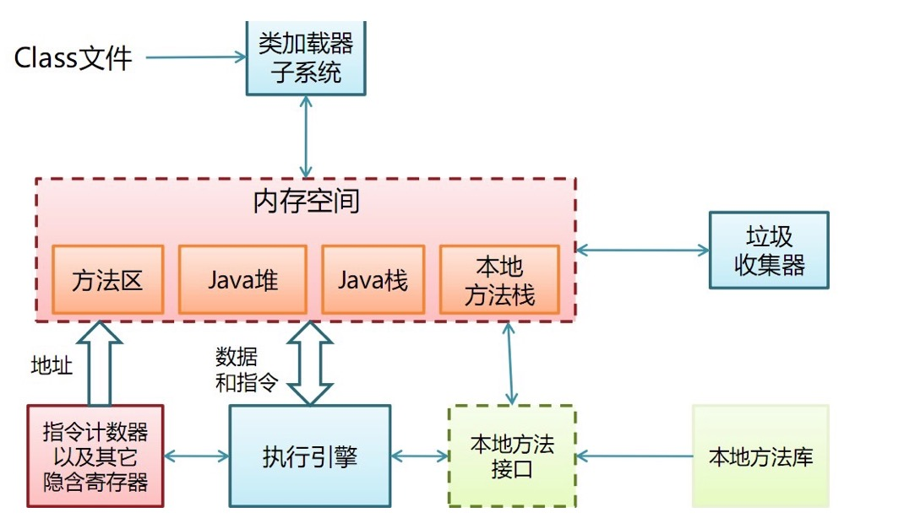
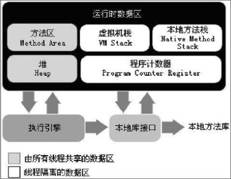

# JVM内存布局

首先来看JVM的内存布局图
  
再来看一张书上的图，作为对比。  

首先我们可以看出，线程私有的内存区域为虚拟机栈、本地方法栈以及程序计数器。  
共享的区域为方法区和堆，这其实和C/C++里的线程基本意思是一致的，线程有自己的执行序列，其他部分都是共享的。 

- 程序计数器

首先来看看Oracle官方文档的解释
> 2.5.1. The pc Register  
>
>The Java Virtual Machine can support many threads of execution at once (JLS §17). Each Java Virtual Machine thread has its own pc (program counter) register. At any point, each Java Virtual Machine thread is executing the code of a single method, namely the current method (§2.6) for that thread. If that method is not native, the pc register contains the address of the Java Virtual Machine instruction currently being executed. If the method currently being executed by the thread is native, the value of the Java Virtual Machine's pc register is undefined. The Java Virtual Machine's pc register is wide enough to hold a returnAddress or a native pointer on the specific platform.  

主要意思是，每一个Java线程拥有自己的程序计数器，如果当前线程执行的不是本地方法的话，程序计数器存的是当前被执行指令的地址。

- Java虚拟机栈

官方解释如下
>2.5.2. Java Virtual Machine Stacks
>
>Each Java Virtual Machine thread has a private Java Virtual Machine stack, created at the same time as the thread. A Java Virtual Machine stack stores frames (§2.6). A Java Virtual Machine stack is analogous to the stack of a conventional language such as C: it holds local variables and partial results, and plays a part in method invocation and return. Because the Java Virtual Machine stack is never manipulated directly except to push and pop frames, frames may be heap allocated. The memory for a Java Virtual Machine stack does not need to be contiguous.
>
>In the First Edition of The Java® Virtual Machine Specification, the Java Virtual Machine stack was known as the Java stack.
>
>This specification permits Java Virtual Machine stacks either to be of a fixed size or to dynamically expand and contract as required by the computation. If the Java Virtual Machine stacks are of a fixed size, the size of each Java Virtual Machine stack may be chosen independently when that stack is created.
>
>A Java Virtual Machine implementation may provide the programmer or the user control over the initial size of Java Virtual Machine stacks, as well as, in the case of dynamically expanding or contracting Java Virtual Machine stacks, control over the maximum and minimum sizes.
>
>The following exceptional conditions are associated with Java Virtual Machine stacks:
>
>If the computation in a thread requires a larger Java Virtual Machine stack than is permitted, the Java Virtual Machine throws a StackOverflowError.
>
>If Java Virtual Machine stacks can be dynamically expanded, and expansion is attempted but insufficient memory can be made available to effect the expansion, or if insufficient memory can be made available to create the initial Java Virtual Machine stack for a new thread, the Java Virtual Machine throws an OutOfMemoryError.

主要意思是，虚拟机栈为线程私有的，和线程同时创建。java的虚拟机栈和C语言的栈类似：保存局部变量和部分结果，作为方法调用和返回的一部分。栈使用pop和push来进行控制，可以是被堆分配，（这点和C语言并不一样，在linux中，栈的起始在虚拟地址空间3G的位置，向下增长，linux中的堆区在bss段之上，栈和堆中还隔着一个mmap映射区，所以两者并没有联系）Java的虚拟机栈并不要求内存连续。
两个例外条件：
如果一个线程需要的栈空间比允许的大，java虚拟机会抛出StackOverflowError。
如果Java虚拟机栈可以动态增长，但是内存不足以扩张或者内存不足以初始化Java虚拟机栈，java虚拟机会抛出一个OutOfMemoryError。

- 本地方法栈

看文档如下
>2.5.6. Native Method Stacks
>
>An implementation of the Java Virtual Machine may use conventional stacks, colloquially called "C stacks," to support native methods (methods written in a language other than the Java programming language). Native method stacks may also be used by the implementation of an interpreter for the Java Virtual Machine's instruction set in a language such as C. Java Virtual Machine implementations that cannot load native methods and that do not themselves rely on conventional stacks need not supply native method stacks. If supplied, native method stacks are typically allocated per thread when each thread is created.
>
>This specification permits native method stacks either to be of a fixed size or to dynamically expand and contract as required by the computation. If the native method stacks are of a fixed size, the size of each native method stack may be chosen independently when that stack is created.
>
>A Java Virtual Machine implementation may provide the programmer or the user control over the initial size of the native method stacks, as well as, in the case of varying-size native method stacks, control over the maximum and minimum method stack sizes.
>
>The following exceptional conditions are associated with native method stacks:
>
>If the computation in a thread requires a larger native method stack than is permitted, the Java Virtual Machine throws a StackOverflowError.
>
>If native method stacks can be dynamically expanded and native method stack expansion is attempted but insufficient memory can be made available, or if insufficient memory can be made available to create the initial native method stack for a new thread, the Java Virtual Machine throws an OutOfMemoryError.

性质上和上边的虚拟机栈一样（抛出的异常也一样），本地方法栈执行的是Native方法。

- Java堆

官方文档如下
>2.5.3. Heap
>
>The Java Virtual Machine has a heap that is shared among all Java Virtual Machine threads. The heap is the run-time data area from which memory for all class instances and arrays is allocated.
>
>The heap is created on virtual machine start-up. Heap storage for objects is reclaimed by an automatic storage management system (known as a garbage collector); objects are never explicitly deallocated. The Java Virtual Machine assumes no particular type of automatic storage management system, and the storage management technique may be chosen according to the implementor's system requirements. The heap may be of a fixed size or may be expanded as required by the computation and may be contracted if a larger heap becomes unnecessary. The memory for the heap does not need to be contiguous.
>
>A Java Virtual Machine implementation may provide the programmer or the user control over the initial size of the heap, as well as, if the heap can be dynamically expanded or contracted, control over the maximum and minimum heap size.
>
>The following exceptional condition is associated with the heap:
>
>If a computation requires more heap than can be made available by the automatic storage management system, the Java Virtual Machine throws an OutOfMemoryError.

堆区被所有Java线程共享，是所有类实例化和arrays分配内存的运行时区域。堆区在Java虚拟机启动的时候被创建，GC来管理（C程序中，堆内存是由程序员自己管理，比如malloc和free函数，这点是很大的不同）堆区内存是可扩展的，也可未必是连续的。
申请过多内存会抛出OutOfMemoryError。

- 方法区

文档如下
>2.5.4. Method Area
>
>The Java Virtual Machine has a method area that is shared among all Java Virtual Machine threads. The method area is analogous to the storage area for compiled code of a conventional language or analogous to the "text" segment in an operating system process. It stores per-class structures such as the run-time constant pool, field and method data, and the code for methods and constructors, including the special methods (§2.9) used in class and instance initialization and interface initialization.
>
>The method area is created on virtual machine start-up. Although the method area is logically part of the heap, simple implementations may choose not to either garbage collect or compact it. This specification does not mandate the location of the method area or the policies used to manage compiled code. The method area may be of a fixed size or may be expanded as required by the computation and may be contracted if a larger method area becomes unnecessary. The memory for the method area does not need to be contiguous.
>
>A Java Virtual Machine implementation may provide the programmer or the user control over the initial size of the method area, as well as, in the case of a varying-size method area, control over the maximum and minimum method area size.
>
>The following exceptional condition is associated with the method area:
>
>If memory in the method area cannot be made available to satisfy an allocation request, the Java Virtual Machine throws an OutOfMemoryError.

方法区是所有线程共享的，存放编译后的代码，很像C程序的text段。方法区存储每一个类的结构。
方法区创建在虚拟机启动时，虽然是堆区的一部分，但是并不会垃圾回收或者压缩，规范并不会要求方法区的位置，方法区是可扩展的。
分配过大内存同样会抛出OutOfMemoryError。

- 运行时常量池

文档如下
>2.5.5. Run-Time Constant Pool
>
>A run-time constant pool is a per-class or per-interface run-time representation of the constant_pool table in a class file (§4.4). It contains several kinds of constants, ranging from numeric literals known at compile-time to method and field references that must be resolved at run-time. The run-time constant pool serves a function similar to that of a symbol table for a conventional programming language, although it contains a wider range of data than a typical symbol table.
>
>Each run-time constant pool is allocated from the Java Virtual Machine's method area (§2.5.4). The run-time constant pool for a class or interface is constructed when the class or interface is created (§5.3) by the Java Virtual Machine.
>
>The following exceptional condition is associated with the construction of the run-time constant pool for a class or interface:
>
>When creating a class or interface, if the construction of the run-time constant pool requires more memory than can be made available in the method area of the Java Virtual Machine, the Java Virtual Machine throws an OutOfMemoryError.
>
>See §5 (Loading, Linking, and Initializing) for information about the construction of the run-time constant pool.

类似于C程序的符号表，但是比符号表更宽泛。
每一个常量池都是从方法区分配，它是在类或接口被虚拟机创建时被构建。
需要的内存比虚拟机所能申请的多时，同样抛出OutOfMemoryError。