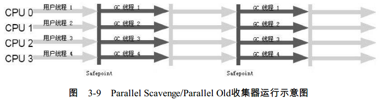

# 垃圾收集器

首先看一下各个收集器的位置以及相互的使用组合。
  

- Serial收集器  

serial收集器是一个单线程的收集器，进行垃圾收集时，必须暂停其他工作线程。  
优点：简单高效。对于运行在Client模式下的虚拟机来说是一个很好的选择。

- ParNew收集器

ParNew收集器其实就是Serial收集器的多线程版本，它是许多运行在Server模式下的虚拟机中首选的新生代收集器，其中有一个与性能无关但很重要的原因是，除了Serial收集器以外，目前只有它能与CMS收集器配合工作。

- Parallel Scavenge收集器

Parallel Scavenge收集器是一个新生代的收集器，它也是使用复制算法的收集器，又是并行的多线程收集器。特点是，它的关注点与其他收集器不同，CMS等收集器的关注点是尽可能的缩短垃圾收集时用户线程的停顿时间，而Paralle Scavenge收集器的目标则是达到一个可控制的吞吐量。  
停顿时间越短就越适合与用户交互的程序，良好的响应速度能提升用户体验，而高吞吐量则可以高效率地利用CPU时间，尽快完成程序的运算任务，主要适合在后台运算而不需要太多交互的任务。

- Serial Old收集器

Serial Old收集器是Serial收集器的老年代版本，它同样是一个单线程收集器，使用“标记-整理”算法。这个收集器的主要意义在于给Client模式下的虚拟机使用。如果在Server模式下，那么它主要还有两大用途：一种用途是在JDK1.5以及之前的版本中与Parallel Scavenge收集器搭配使用，另一种用途就是作为CMS收集器的后备预案，在并发收集发生Concurrent Mode Failure时使用。

- Parallel Old收集器

Parallel Old是Parallel Scavenge收集器的老年代版本，使用多线程和“标记-整理”算法。在注重吞吐量以及CPU资源敏感的场合，都可以优先考虑Parallel Scavenge加Parallel Old收集器。

- CMS收集器

CMS（Concurrent Mark Sweep）收集器是一种以获取最短回收停顿时间为目标的收集器。目前很大一部分的Java应用集中在互联网站或者B/S系统的服务端上，这类应用尤其重视服务的响应速度，希望系统停顿时间最短，以给用户带来较好的体验。CMS收集器就非常符合这类应用的需求。  
整个过程分为4个步骤，包括：  
初始标记  
并发标记  
重新标记  
并发清除  
初始标记仅仅只是标记一下GC Roots能直接关联到的对象，速度很快，并发标记阶段就是进行GC RootsTracing的过程，而重新标记阶段则是为了修正并发标记期间因用户程序继续运作而导致标记产生变动的那一部分对象的标记记录，这个阶段的停顿时间一般会比初始阶段稍长一些，但远比并发标记的时间短。
  
CMS是一款优秀的收集器，它的主要优点在名字上已经体现出来了：并发收集、低停顿。但它还有3个明显的缺点：  
对CPU资源非常敏感。在并发阶段，它虽然不会导致用户线程停顿，但是会因为占用了一部分线程（或者说CPU资源）而导致应用程序变慢，总吞吐量会降低。CMS默认启动的回收线程数是（CPU数量+3）/4，也就是当CPU在4个以上时，并发回收时垃圾收集线程不少于25%的CPU资源，并且随着CPU数量的增加而下降。但是当CPU不足4个时，CMS对用户程序的影响就可能变得很大。  
CMS收集器无法处理浮动垃圾，可能出现“Concurrent Mode Failure”失败而导致另一次Full GC的产生。由于CMS并发清理阶段用户线程还在运行着，伴随程序运行自然就还会有新的垃圾不断产生，这一部分垃圾出现在标记过程之后，CMS无法在当次收集中处理掉它们，只好留待下一次GC时再清理掉。这一部分垃圾就称为“浮动垃圾”。也是由于在垃圾收集阶段用户线程还需要运行，那也就还需要预留足够的内存空间给用户线程使用，因此CMS收集器不能像其他收集器那样等到老年代几乎完全被填满了再进行收集，需要预留一部分空间提供并发收集时的程序运作使用。  
CMS是一款基于“标记-清除”算法实现的收集器，收集结束时会有大量空间碎片产生。空间碎片过多时，将会给大对象分配带来很大麻烦，往往会出现老年代还有很大空间剩余，但是无法找到足够大的连续空间来分配当前对象，不得不提前触发一次Full GC。

- G1收集器

G1（Garbage-First）收集器是当今收集器技术发展最前沿成果之一，是一款面向服务端应用的垃圾收集器。HotSpot开发团队赋予它的使命是（在比较长期的）未来可以替换掉JDK1.5中发布的CMS收集器。与其他GC收集器相比，G1具备如下特点。  
并行与并发：G1能充分利用多CPU、多核环境下的硬件优势，使用多个CPU（CPU或者CPU核心）来缩短Stop-The-World停顿的时间，部分其他收集器原本需要停顿Java线程执行的GC动作，G1收集器仍然可以通过并发的方式让Java程序继续执行。  
分代收集：与其他收集器一样，分代概念在G1中依然得以保留。虽然G1可以不需要其他收集器配合就能独立管理整个GC堆，但它能够采用不同的方式去处理新创建的对象和已经存活了一段时间、熬过多次GC的旧对象以获取更好的收集效果。  
空间整合：与CMS的“标记-清理”算法不同，G1从整体来看是基于“标记-整理”算法实现的收集器，从局部上来看是基于“复制”算法实现的，但无论如何，这两种算法都意味着G1运作期间不会产生内存空间碎片，收集后能提供规整的可用内存。这种特性有利于程序长时间运行，分配大对象时不会因为无法找到连续内存空间而提前触发下一次GC。  
可预测的停顿：这是G1相对于CMS的另一大优势，降低停顿时间是G1和CMS共同的关注点，但G1除了追求低停顿外，还能建立可预测的停顿时间模型，能让使用者明确指定在一个长度为M毫秒的时间片段内，消耗在垃圾收集上的时间不得超过N毫秒，这几乎已经是实时Java（RTSJ）的垃圾收集器的特征了。  
在G1之前的其他收集器进行收集的范围都是整个新生代或者老年代，而G1不再是这样。使用G1收集器时，Java堆的内存布局就与其他收集器有很大差别，它将整个Java堆划分为多个大小相等的独立区域（Region），虽然还保留有新生代和老年代的概念，但新生代和老年代不再是物理隔离的了，它们都是一部分Region（不需要连续）的集合。  
G1收集器之所以能建立可预测的停顿时间模型，是因为它可以有计划地避免在整个Java堆中进行全区域的垃圾收集。G1跟踪各个Region里面的垃圾堆积的价值大小（回收所获得的空间以及回收所需时间的经验值），在后台维护一个优先列表，每次根据允许的收集时间，优先回收价值最大的Region（这也就是Garbage-First名称的来由）。这种使用Region划分内存空间以及有优先级的区域回收方式，保证了G1收集器在有限的时间内可以获取尽可能高的收集效率。  
G1收集器的运作大致可划分为一下几个步骤：  
初始标记  
并发标记  
最终标记  
筛选回收
初始标记阶段仅仅只是标记一下GC Roots能直接关联到的对象，并且修改TAMS（Next Top at Mark Start）的值，让下一阶段用户程序并发运行时，能在正确可用的Region中创建新对象，这阶段需要停顿线程，但耗时很短。  
并发标记阶段是从GC Root开始对堆中对象进行可达性分析，找出存活的对象，这阶段耗时较长，但可与用户程序并发执行。  
最终标记阶段则是为了修正在并发标记期间因用户程序继续运作而导致标记产生变动的那一部分标记记录，虚拟机将这段时间对象变化记录在线程Remembered Set Logs里面，最终标记阶段需要把Remembered Set Logs的数据合并到Remembered Set中，这阶段需要停顿线程，但是可并行执行。最后在筛选回收阶段首先对各个Region的回收价值和成本进行排序，根据用户所期望的GC停顿时间来指定回收计划。

