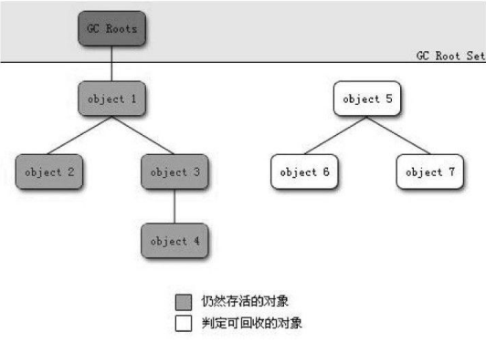

# JVM垃圾回收

GC需要完成的三件事情  
- 回收哪些内存  
- 什么时候回收  
- 如何回收  

首先一个问题是，如何确定对象是否需要被回收，判断的标准是什么？  
对于哪些我们不再使用的对象，JVM是如何感知到的呢？  
下面来介绍几种方法  
- 引用计数算法

一个很容易想到的方法就是引用计数法，给对象加上一个引用计数器，如果引用这个对象，计数器就增一，反之，减一操作，当引用计数为0时，即可进行回收。  
这个方法实现简单，判定效率高，在大部分情况下都是一个不错的算法。（C++中的boost智能指针就是用的引用计数）  
但是，主流的Java虚拟机并没有使用引用计数来管理内存，主要原因是它很难解决对象之间相互循环引用的问题。比如，一个类A对象的一个成员变量引用一个类B对象，而另一个类B对象的一个成员变量引用一个类A对象，就算释放两个类对象，其成员变量还保持相互引用的关系。

- 可达性分析

基本思想就是通过一系列的GC Roots对象作为起始点，从这些节点开始向下搜索，搜索所走过的路称为引用链，当一个对象到GC Roots没有任何引用链相连时，则证明此对象是不可用的。
  
在Java中，可作为GC Roots的对象包括下面几种：  
虚拟机栈中引用的对象  
方法区中静态属性引用的对象  
方法区中常量引用的对象  
本地方法栈中引用的对象 

- 谈谈引用

JDK1.2之后，Java对引用的概念进行了扩充，将引用分为强引用、软引用、弱引用、虚引用，这四种引用的强度依次逐渐减弱。  

强引用就是普遍存在的 Object obj=new Object();只要强引用还在，就不会被垃圾收集器回收。 
 
软引用用来描述一些有用但并非必需的对象。对于软引用关联的对象，在系统将要发生内存溢出之前，将会把这些对象列进回收范围之中进行二次回收。如果这次回收还没有足够的内存，才会抛出内存溢出异常。在JDK1.2之后，提供了SoftReference类来实现软引用。

弱引用也是用来描述非必需对象的，但是它的强度比软引用更弱一些，被弱引用关联的对象只能生存到下一次垃圾收集发生之前。当垃圾收集器工作时，无论当前内存是否足够，都会回收掉只被弱引用关联的对象。在JDK1.2之后，提供了WeakReference类来实现弱引用。

虚引用也成为幻影引用，它是最弱的一种引用关系。一个对象是否有虚引用的存在，完全不会对其生存时间构成影响，也无法通过虚引用来获得一个对象实例。为一个对象设置虚引用关联的唯一目的就是能在这个对象被收集器回收时收到一个系统通知。在JDK1.2之后，提供了PhantomReference类来实现虚引用。

- 拯救自己

即使在可达性分析算法中不可达的对象，并非会被直接宣告死亡，更不会被立即回收。  
还要至少经历两次标记过程，才能真正宣告一个对象死亡。如果对象在可达性分析后发现没有与GC Roots相连接的引用链，那它将会被第一次标记，并进行一次筛选，筛选条件是此对象是否有必要执行finalize()方法。当对象没有覆盖finalize()方法或者finalize()方法已经被虚拟机调用过，那么，虚拟机将这两种情况都视为“没有必要执行”。

如果这个对象被判定为有必要执行finalize()方法，那么这个对象将会放置在一个叫做F-Queue的队列之中，并在稍后由一个虚拟机自动建立的、低优先级的Finalizer线程去执行。这里的“执行”，并不会承诺等待它运行结束，这样做的原因是，如果一个对象在finalize()方法中执行缓慢，或者发生了死循环，将导致F-Queue中其他对象永远处于等待状态，甚至导致整个回收系统崩溃。  
finalize()方法是对象拯救自己最后的机会，稍后GC将对F-Queue中的对象进行第二次小规模标记，如果对象要在finalize()中成功拯救自己（只要重新与引用链上的任何一个对象建立关联即可，譬如把自己的this关键字赋值给某个类变量或者对象的成员变量），那在第二次标记时，它将被移除“即将回收”集合。如果对象这时候还没有逃脱，那基本上就是真的被回收了。

- 方法区的回收

方法区（HotSpot虚拟机中的永久代）的垃圾收集效率相当低，远低于新生代的垃圾收集效率。  

永久代的垃圾回收主要包含两部分：废弃常量和无用的类。回收废弃常量与回收Java堆中的对象非常类似。以常量池中字面量的回收为例，假如一个字符串已经进入了常量池中，但是当前系统没有任何一个String对象是引用它的。如果这个时候发生了内存回收，而且必要的话，这个常量就会被系统清理出常量池。常量池中的其他类（接口）、方法、字段的符号引用也与此类似。

判定一个常量是否是“废弃常量”比较简单，而要判定一个类是否是“无用的类”的条件则相对苛刻许多。类需要同时满足下面3个条件才能算是“无用的类”。
该类所有的实例都已经被回收，也就是Java堆中不存在该类的任何实例。  
加载该类的ClassLoader已经被回收。  
该类对应的java.lang.Class对象没有在任何地方被引用，无法在任何地方通过反射访问该类的方法。

虚拟机可以对满足上述3个条件的无用类进行回收，这里说的仅仅是“可以”，而并不是和对象一样，不使用了就必然会回收。

在大量使用反射、动态代理、CGLib等ByteCode框架、动态生成JSP以及OSGi这类频繁自定义ClassLoader的场景都需要虚拟机具备类卸载的功能，以保证永久代不会溢出。
